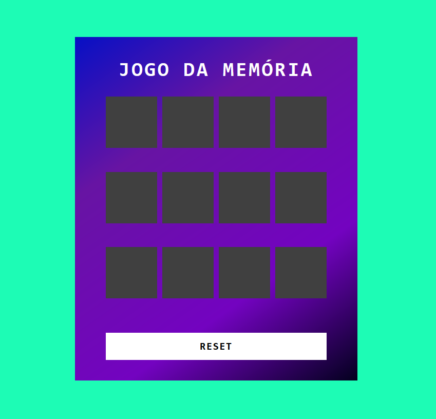
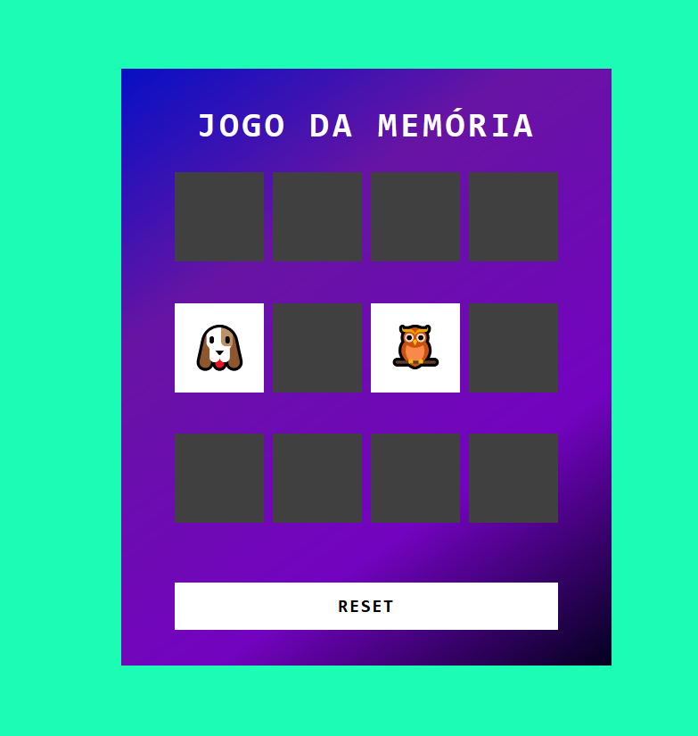
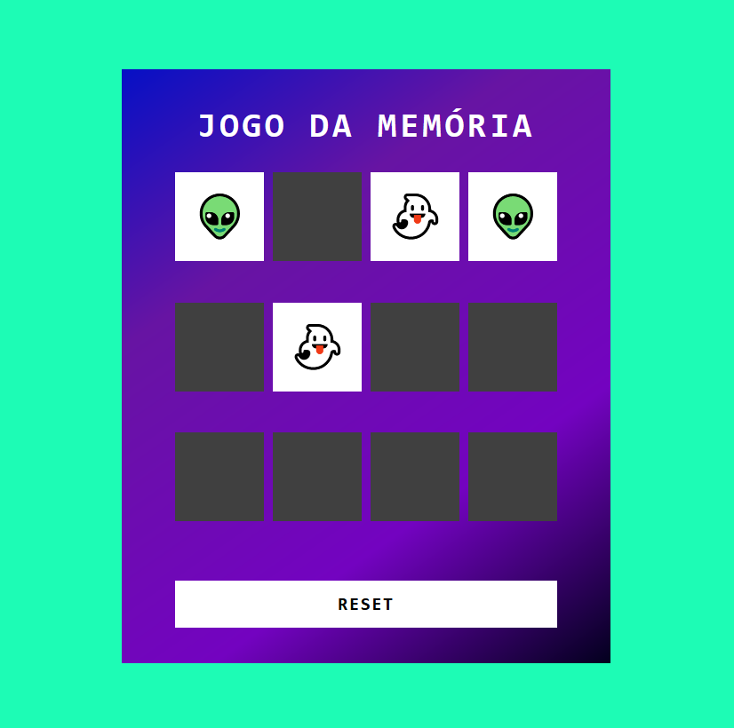
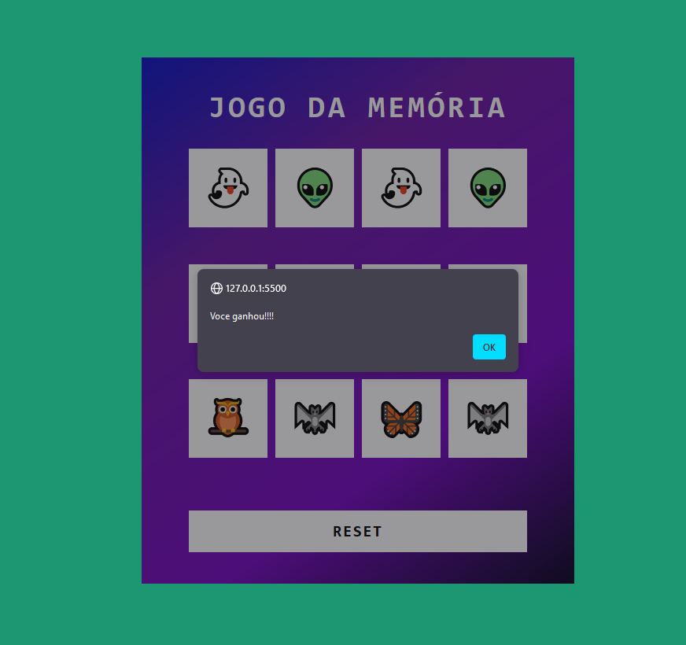
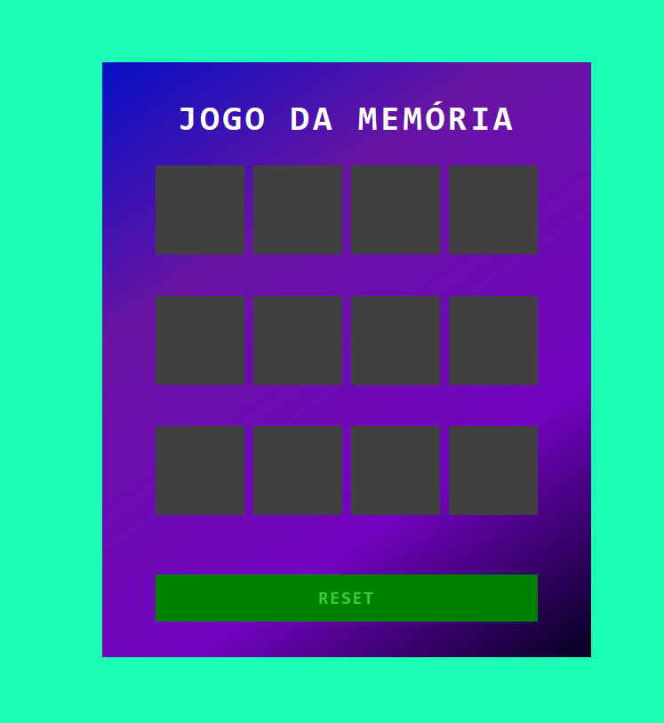

# Jogo da Memória - Bootcamp Potencia Tech iFood

Bem-vindo ao repositório do Jogo da Memória desenvolvido durante o Bootcamp Potencia Tech iFood, oferecido pela Digital Innovation One. Este jogo interativo foi construído usando tecnologias web padrão, como HTML, JavaScript e CSS.

## Estrutura do Projeto

O projeto consiste em três principais arquivos:

* index.html: Página principal que contém a estrutura do jogo.
* src/styles/reset.css: Arquivo de estilo para redefinir estilos padrão do navegador.
* src/styles/main.css: Arquivo de estilo principal para o jogo.
* src/scripts/engine.js: Script JavaScript responsável pela lógica do jogo.

## Funcionalidades Principais

* engine.js

Este arquivo contém a lógica central do jogo. Aqui estão comentários sobre algumas das funções mais importantes:

## Como Jogar

Click aqui:
https://efraimrocha.github.io/jogo-da-memoria/

ou

1. Abra o arquivo index.html em um navegador web.

2. Clique nas cartas para virá-las.

3. Encontre todos os pares de cartas idênticas.

4. Ao vencer é exibido um alert informando que voê enceu.

5. Use o botão RESET para reiniciar o jogo.

# Divirta-se jogando o Jogo da Memória!

Desenvolvido por Efraim Rocha durante o Bootcamp Potencia Tech iFood na Digital Innovation One.
